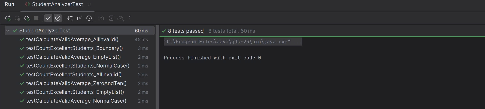

# Bài thực hành kiểm thử với JUnit

1. Mục tiêu

2. Mô tả bài toán
Xây dựng lớp `StudentAnalyzer` để phân tích điểm số học sinh:

3. Cấu trúc thư mục

- unit-test/
	- src/StudentAnalyzer.java
	- test/StudentAnalyzerTest.java
	- README.md

**Tóm tắt mã nguồn — StudentAnalyzer**

Mục tiêu: lớp `StudentAnalyzer` xử lý danh sách điểm học sinh để trích xuất các thông tin thống kê cơ bản, đồng thời bỏ qua dữ liệu không hợp lệ.

Các chức năng chính:
- Lọc điểm hợp lệ: chỉ chấp nhận điểm trong khoảng 0 đến 10 (bao gồm).
- Đếm học sinh đạt loại Giỏi: số điểm >= 8.0.
- Tính điểm trung bình: trung bình chỉ trên tập điểm hợp lệ.

Trường hợp kiểm thử (có trong `test/StudentAnalyzerTest.java`):
- Điểm hợp lệ ảnh hưởng đúng đến trung bình.
- Giá trị không hợp lệ (<0 hoặc >10) bị loại bỏ trước khi tính toán.
- Các biên (0 và 10) được xử lý là hợp lệ.
- Tập dữ liệu chỉ chứa giá trị không hợp lệ (kịch bản biên).

Tệp liên quan:
- [src/StudentAnalyzer.java](src/StudentAnalyzer.java) — logic xử lý và hàm chính.
- [test/StudentAnalyzerTest.java](test/StudentAnalyzerTest.java) — bộ kiểm thử JUnit covering các kịch bản nêu trên.

4. Kết quả kiểm thử

